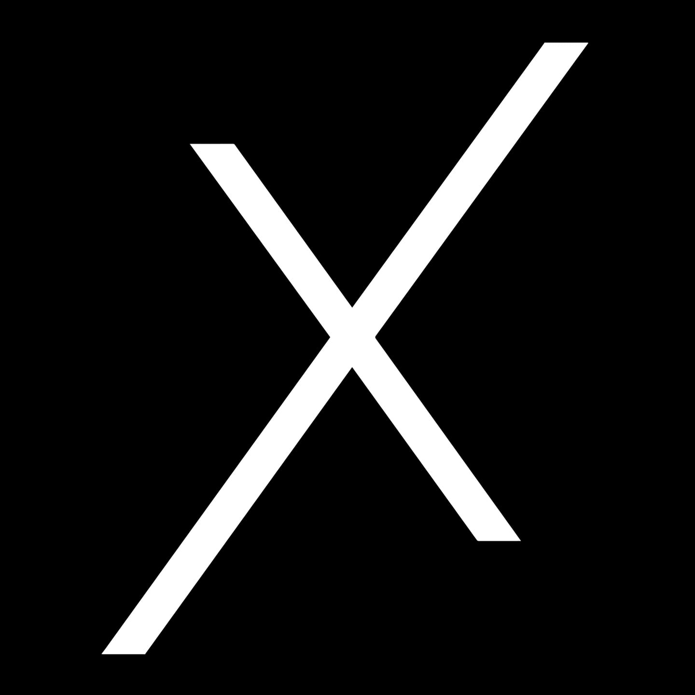

<a name="readme-top">

<br/>

<br />
<div align="center">
  <a href="https://github.com/Aleksaucey/">
  <!-- TODO: If you want to add logo or banner you can add it here -->
    
  </a>
<!-- TODO: Change Title to the name of the title of your Project -->
  <h3 align="center">Responsive Website</h3>
</div>
<!-- TODO: Make a short description -->
<div align="center">Oxgn Multipage website
</div>

<br />

<!-- TODO: Change the zyx-0314 into your github username  -->
<!-- TODO: Change the WD-Template-Project into the same name of your folder -->


[](https://wakatime.com/badge/user/1e7d773a-0b01-4a3f-be97-4135bd1d086c/project/e4972f4f-626c-4ff3-913c-5ee3edf136b6)

---

<br />
<br />

<!-- TODO: If you want to add more layers for your readme -->
<details>
  <summary>Table of Contents</summary>
  <ol>
    <li>
      <a href="#overview">Overview</a>
      <ol>
        <li>
          <a href="#key-components">Key Components</a>
        </li>
        <li>
          <a href="#technology">Technology</a>
        </li>
      </ol>
    </li>
    <li>
      <a href="#rule,-practices-and-principles">Rules, Practices and Principles</a>
    </li>
    <li>
      <a href="#resources">Resources</a>
    </li>
  </ol>
</details>

---

## Overview

<!-- TODO: To be changed -->
<!-- The following are just sample -->
The purpose of this project is to showcase Bootstrap and Tailwind features that we can add in our website, this is the final
requirement for our course CCS0027L.
Our group were assigned to create a clothing company to create a website, I specifically chose OXGN Fashion.
HTML, CSS, Tailwind and Bootstrap were used for these project to utilize a multipage website that can be atleast
tablet responsive.
<br>
The key components of this project is that the 3 products that can be seen in the landing page has their own product pages,
the navigation bar and background images are responsive as well as the product cards in the products area,
a total of 7 pages inlcuding the landing page were the features of this website.
<br>
### Key Components
<!-- TODO: List of Key Components -->
<!-- The following are just sample -->
- MultiPage Website

### Technology
<!-- TODO: List of Technology Used -->


## Rules, Practices and Principles
1. Always use `WD-` in the front of the Title of the Project for the Subject followed by your custom naming.
2. Do not rename any .html files; always use `index.html` as the filename.
3. Place Files in their respective folders.
4. All file naming are in camel case.
   - Camel case is naming format where there is no white space in separation of each words, the first word is in all lower case while the succeding words first letter are in upper followed by lower cased letters.
   - ex.: buttonAnimatedStyle.css
5. Use only `External CSS`.
6. Renaming of Pages folder names are a must, and relates to what it is doing or data it holding.
7. File Structure to follow below.

```
WD-ProjectName
└─ assets
|   └─ css
|   |   └─ style.css
|   └─ img
|   |   └─ fileWith.jpeg/.jpg/.webp/.png
|   └─ js
|       └─ script.js
└─ pages
|  └─ pageName
|     └─ assets
|     |  └─ css
|     |  |  └─ style.css
|     |  └─ img
|     |  |  └─ fileWith.jpeg/.jpg/.webp/.png
|     |  └─ js
|     |     └─ script.js
|     └─ index.html
└─ index.html
└─ readme.md
```

## Resources

<!-- TODO: Add References -->
| Title | Purpose | Link |
|-|-|-|
| OXGN Fashion | Main Reference for the website. | https://www.oxgnfashion.com/ |
| Bootstrap NavBar | Used and revised for navigation bar. | https://mdbootstrap.com/docs/standard/navigation/navbar/examples-and-customization/ |
| Responsive Image | Used for the background responsiveness. | https://www.w3schools.com/howto/howto_css_image_responsive.asp |
| Bootstrap Footer | Used and revised for the footer of the website. | https://mdbootstrap.com/docs/standard/navigation/footer/examples-and-customization/ |
| Website Favicon | Used for the website favicon. | https://www.w3schools.com/html/html_favicon.asp |
| Z-Index | Used for positioning the button in landing page. | https://www.w3schools.com/cssref/pr_pos_z-index.php |
| Button in the Image | Used to create a button at the front of an image. | https://www.w3schools.com/howto/howto_css_button_on_image.asp |
| Bootstrap Product List | Used and revised for product cards in products page | https://bbbootstrap.com/snippets/bootstrap-ecommerce-product-grid-view-card-19577966 |
| Bootstrap Product Cards | Used and revised for product card in landing page and products page. | https://freefrontend.com/bootstrap-product-cards/ |
| Bootstrap Containers | Used for positioning product description and buttons | https://getbootstrap.com/docs/5.0/layout/containers/ |
| Color Specificity | Fixing the color to alter the bootstrap in css | https://developer.mozilla.org/en-US/docs/Web/CSS/Specificity |
| Button Styling | Used to style the buttons in the product page. | https://www.w3schools.com/css/css3_buttons.asp |